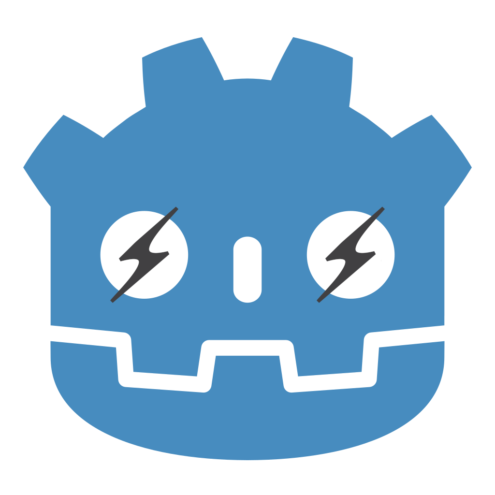

# Godot-Das: daScript bindings for Godot





This project is a Godot module that ~~integrates~~ will integrate [daScript](https://dascript.org/) scripting language into Godot game engine

## Download

This project is build as an engine submodule (see why not as a GDExtension in docs), so you will need to download Godot repo:

```
git clone git@github.com:godotengine/godot.git
```

The develompent is done on Godot's master branch

Next, clone this repo as a submodule in *godot/modules/*. Rename the directory to *dascript*:

```
cd godot/modules
git clone git@github.com:ilyabelow/godot-das.git dascript
```

You will also need daScript, so download its repo as a submodule:

```
cd dascript
git submodule update --init
```

Don't use clone with `--recurse-submodules` as it will download daScript submodules which are not needed

## Bulding

First, build daScript static library:

```
cd daScript
cmake CMakeFiles.txt
make -j<cores>
```

The project will only need *liblibDaScript.a* and headers from *daScript/include/*, so you can delete the rest

Next, build Godot:

```
cd <godot root directory>
scons (or pyston-scons if configured)
```

daScript module will be enabled by default, you can disable it with `module_luascript_enabled=no` (or change `is_enabled` function in `config.py`)

> Important: daScript is built with `g++` and `ld`, so make sure **not** to use `clang` or `lld` for building Godot! 

## Testing

Run

```
bin/<your godot binary> modules/dascript/demo/project.godot
```

It should print `this is nano tutorial`, which is the daScript script that is being run on module initialization!

If you want to debug, to *daSctipt/CMakeFiles.txt* add line `set(CMAKE_BUILD_TYPE Debug)`, and to scons config add `dev_build=yes`


## Notes

[This luascript integration](https://github.com/perbone/luascript) is used as a reference