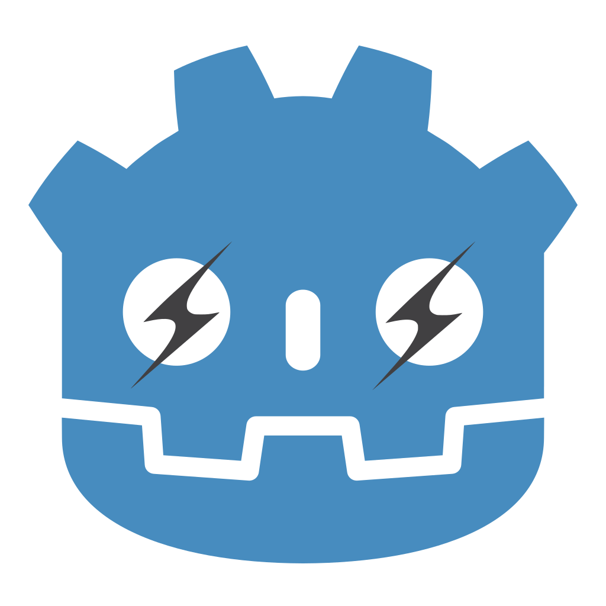

# Godot-Das: Daslang bindings for Godot





This project is a Godot module that ~~integrates~~ will integrate [Daslang (former daScript)](https://dascript.org/) language into Godot game engine

## Download

This project is build as an engine submodule, so you will need to download Godot repo:

```
git clone -b 4.2 git@github.com:godotengine/godot.git
```

The develompent is done on Godot's `4.2` branch (will move to the next version once it's stable)

Next, clone this repo to *godot/modules/*. Rename the directory to *daslang*:

```
cd godot/modules
git clone git@github.com:ilyabelow/godot-das.git daslang
```

You will also need Daslang itself, so download its repo as a submodule:

```
cd daslang
git submodule update --init
```

Don't use `clone` with `--recurse-submodules`, as it will download Daslang submodules which are not needed

Note: if daScript repo is finally renamed, this will not work, so if I forget to update this, please remind me and in the meantime download Daslang by hand

## Bulding

First, build Daslang static library:

```
cmake -B __cmake_temp
cmake --build __cmake_temp -j<cores>
```

This will put *liblibDaScript.a* in *lib* directory. The project will only need headers from *daScript/include/*, so you can delete the rest in *daScript* directory

Next, build Godot:

```
cd <godot root directory>
scons (or pyston-scons, if configured, it should be a bit faster)
```

Daslang module will be enabled by default, you can disable it with `module_daslang_enabled=no` (or change `is_enabled` function in `modules/daslang/config.py`)

Use `linker=lld` or `linker=mold` because default `ld` is super slow

**Important**: Daslang is built with `g++`, so make sure **not** to use `clang` for building Godot!

### Code generation

All files named *\*_gen.\** are generated. To regenerate them, run the binary with `--bind-das` option (place it after `--`):

```
bin/<your godot binary> -- --bind-das
```

Change `types` variable in *src/generate_bindings.cpp* to generate bindings for required types (tmp solution)

## Testing

For now, all Daslang code for Godot - casts, macros, utils - are located in *boost* directory. Also, *daslib* should be there too, for now soft link to *daScript/daslib* is created. *boost* directory should be copied or linked inside every Godot project that use Daslang (links are already in place for examples). Later all this code will be embedded into the binary

Finally, to run an example, from Godot root directory run

```
bin/<your godot binary> modules/daslang/examples/<example>/project.godot
```

You can add `options tool = true` to enable tool mode (so the object will be active inside editor, which can crash)

Add `--windowed` if using a big monitor

Don't forget to add `dev_build=yes` to scons config for debugging. If you want a release build, remove `set(CMAKE_BUILD_TYPE Debug)` from *CMakeLists.txt*

Build and debug jobs, as well as intellisense configuration for VSCode can be found in *_vscode_files*, to use them

```
cd <godot root directory>
ln -s modules/daslang/_vscode_files .vscode
```

### Demo

This demo with just a bunch of staff to demostrate and test different features of the integration

### Bunnymark

This is a port of Bunnymark, which is a crude sanity-check of language performance. Turns out, with GDScript framerate starts to drop after a significantly less bunnies than with Daslang!

More thorough testing will be performed later, this demo is mainly a proof of concept